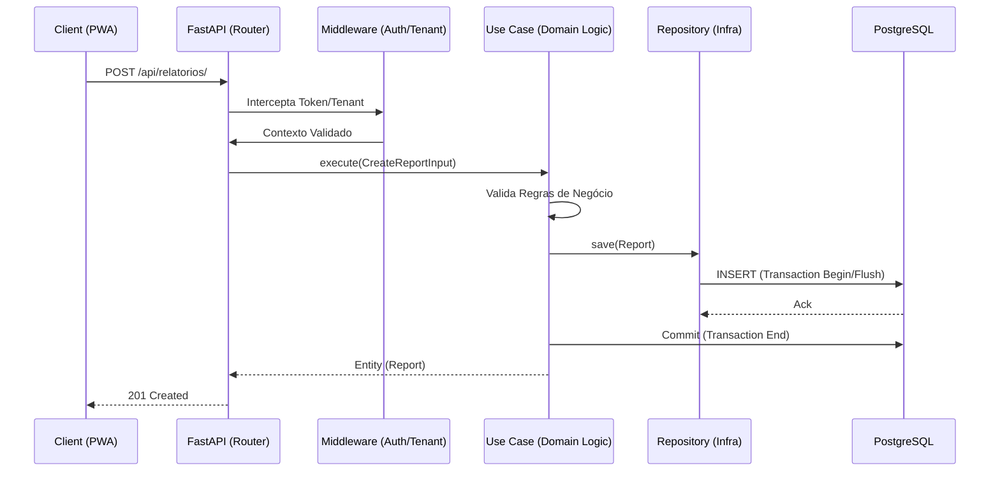

# Apresentação Técnica: Backend Sistema AEE
**Data:** 17 de Abril de 2026  

---

## 💎 Domínio vs. Implementação Backend

A arquitetura do Sistema AEE separa rigorosamente o **Domínio Educacional** da **Implementação Técnica**.

| Dimensão | Domínio (O Quê) | Backend (Como) |
| :--- | :--- | :--- |
| **Identidade** | Gestão de Alunos NEE, PDI e Histórico. | FastAPI + SQLModel (SQLAlchemy 2.0). |
| **Isolamento** | Multi-tenancy (Cidades/Redes distintas). | `tenant_id` mandatory injection & AsyncSession. |
| **Persistência** | Evolução Pedagógica e Evidências. | PostgreSQL 16 + asyncpg (Fully Async). |

> [!TIP]
> Seguimos a **Clean Architecture**: a camada de domínio não conhece o FastAPI; ela define "Ports" que a infraestrutura implementa.

---

## 📄 Regra Crítica: Snapshots de Relatórios

Para garantir a **Integridade Jurídica e Histórica**, implementamos Snapshots de Templates.

- **O Problema:** Se um modelo de relatório mudar em 2027, um relatório feito em 2026 não pode ser corrompido ou mudar de layout.
- **A Solução:** No momento do `save()`, o Use Case captura o estado atual do `ReportTemplate` e o injeta como um objeto estático no `Report`.

```python
# Lógica de Snapshot no Use Case
template = await self.template_repo.get_active_by_tipo(input_dto.tipo)
report = Report(
    tipo=input_dto.tipo,
    aluno_id=input_dto.aluno_id,
    template_snapshot=template.model_dump(mode="json") if template else None
)
```

---

## ⚡ Escovação de Bits: Infraestrutura 100% Assíncrona

O backend foi projetado para alta concorrência com latência mínima.

- **Stack**: Python 3.12 + FastAPI + SQLModel.
- **I/O Não-Bloqueante**: Utilizamos o driver `asyncpg` para comunicação direta com o PostgreSQL sem overhead de threads.
- **Event Loop**: Otimizado para lidar com centenas de requests de sincronização simultâneos.

```python
# Exemplo de Padrão Async (Unit of Work)
class CreateUserUseCase:
    async def execute(self, input_dto: CreateUserInput) -> User:
        async with self.session.begin(): # Transação Atômica
            user = User(...)
            return await self.user_repo.save(user)
```

---

## 🧬 Flexibilidade com JSONB no PostgreSQL

Diferente de sistemas legados, o WebAEE utiliza **Campos Híbridos**.

- **Campos Fortes**: `id`, `tenant_id`, `created_at` (Indexados e Rígidos).
- **Campos Flexíveis (JSONB)**: `conteudo_json` e `secoes`.
- **Vantagem**: Permite que a coordenação crie campos personalizados nos relatórios sem migrações de banco de dados, mantendo a performance de busca do PostgreSQL.

---

## 🔄 Estratégia de Sincronização Offline-First

O suporte ao PWA offline é garantido por uma camada de **Sincronização por Entidade**.

1.  **Pull**: Cliente solicita mudanças desde o último `sync_timestamp`.
2.  **Conflict Resolution**: Utilizamos `updated_at` local vs global para detectar colisões.
3.  **Merge**: O backend processa o lote de forma atômica. Se um registro falhar, o lote é revertido, mantendo a consistência.

---

## 🔐 Autenticação e Segurança (Cofre LGPD)

Proteção total de dados sensíveis de menores.

- **Auth**: JWT com expiração curta e **Refresh Tokens** em banco de dados.
- **Criptografia**: Senhas hasheadas com `bcrypt`. Dados em trânsito sempre via TLS.
- **RBAC (Role Based Access Control)**:
    - `ADMIN`: Gestão global.
    - `COORDENACAO`: Gestão total do tenant.
    - `PROF_AEE`: Gestão de alunos vinculados.

---

## 📝 Auditoria e Isolamento de Dados

Conformidade rigorosa com a LGPD através de registros imutáveis.

- **Audit Log**: Cada alteração sensível (ex: mudança de diagnóstico) gera um registro de auditoria automática.
- **RLS (Concept)**: O `tenant_id` é injetado no contexto da request e aplicado em todas as queries.

```python
# Log de Auditoria Imutável
audit = AuditLog(
    user_id=requesting_user,
    student_id=target_student,
    field_accessed="diagnostico (alteração)",
    timestamp=datetime.now(timezone.utc)
)
```

---

## 🗺️ Jornada do Dado (Fluxo de Execução)

Abaixo, o fluxo linear de uma requisição desde a chegada até a persistência.



---

## 🏆 Qualidade de Software: A Prova dos Nove

Não apenas dizemos que funciona; nós provamos.

- **Cobertura de Testes**: **92,60%** do código é coberto por testes unitários e de integração.
- **Pytest-Asyncio**: Simulação de cenários reais assíncronos.
- **Teste de Regressão**: Cada bug corrigido gera um novo teste permanente.

> [!IMPORTANT]
> A meta mínima de 80% é forçada pelo servidor de CI. Atualmente operamos em um nível de excelência de 92%.

---

## ⚙️ Automação CI/CD (Guardas de Qualidade)

A qualidade é garantida por máquinas, não apenas por humanos.

- **Ruff**: Linting e formatação ultrarrápida (estilo profissional).
- **Mypy**: Checagem de tipos estática (evita erros de "NoneType" em produção).
- **GitHub Actions**: Pipeline que executa a cada `push` para `main`.

| Check | Ferramenta | Objetivo |
| :--- | :--- | :--- |
| Linting | Ruff | Código limpo e padronizado. |
| Typing | Mypy | Segurança de tipos e previne runtime errors. |
| Security | Bandit/Safety | Scan de vulnerabilidades em deps. |
| Tests | Pytest | Lógica de negócio 100% funcional. |

---

## 🚦Mapeamento da Jornada do Usuário

As rotas principais que sustentam a operação do sistema:

1.  **Login**: `/api/auth/login` (Obtenção de Token).
2.  **Dashboard**: `/api/dashboard/stats` (Visão geral de alunos/atendimentos).
3.  **Alunos**: `/api/alunos/` (Listagem e filtragem por tenant).
4.  **Relatórios**: `/api/relatorios/` (Criação com Snapshot de Template).
5.  **Sync**: `/api/sync/` (Caminho crítico para uso offline).

---

## 🏁 Conclusão

O backend do Sistema AEE está **Pronto para Produção**.

- **Evolutivo**: Capaz de lidar com novos tipos de relatórios via JSONB.
- **Escalável**: Arquitetura assíncrona de baixo consumo.
- **Seguro**: Conformidade LGPD por design.
- **Confiável**: Certificado por 92,6% de cobertura de testes.

---
*Apresentação gerada por Antigravity AI.*
