# Casos de Uso — Sistema AEE

**Versão:** 1.0  
**Data:** 20/03/2026  
**Base:** PRD v2.0 + Proposal + Design (sistema-aee-mvp)

---

## Diagrama de Casos de Uso

```mermaid
graph TB
    subgraph Atores
        COO["👩‍💼 Coordenação"]
        PAE["👩‍🏫 Prof. AEE"]
        APO["🧑‍💼 Profissional de Apoio"]
        REG["👩‍🏫 Professora Regente"]
        SYS(("⚙️ Sistema"))
    end

    subgraph Autenticação
        UC01["UC-01\nAutenticar"]
    end

    subgraph Gestão_de_Usuários["Gestão de Usuários"]
        UC02["UC-02\nCadastrar Usuário"]
    end

    subgraph Gestão_de_Alunos["Gestão de Alunos"]
        UC03["UC-03\nCadastrar Aluno"]
        UC04["UC-04\nTransferir Aluno"]
        UC05["UC-05\nArquivar Aluno"]
        UC15["UC-15\nVincular Professor\na Aluno"]
    end

    subgraph Relatórios
        UC06["UC-06\nCriar Relatório AEE"]
        UC07["UC-07\nCriar Relatório Anual"]
        UC08["UC-08\nCriar Relatório Trimestral"]
        UC09["UC-09\nVisualizar e Comentar\nRelatório"]
        UC11["UC-11\nExportar PDF"]
    end

    subgraph Fotos
        UC10["UC-10\nRegistrar Momento\n📸 Captura Rápida"]
    end

    subgraph Dados_Sensíveis["Dados Sensíveis (LGPD)"]
        UC13["UC-13\nVisualizar Dados\nSensíveis do Aluno"]
    end

    subgraph Dashboard_e_Sync["Dashboard & Sync"]
        UC14["UC-14\nVisualizar Dashboard"]
        UC12["UC-12\nSincronizar Dados\nOffline"]
    end

    %% Coordenação
    COO --> UC01
    COO --> UC02
    COO --> UC05
    COO --> UC09
    COO --> UC13
    COO --> UC14
    COO --> UC12

    %% Prof. AEE
    PAE --> UC01
    PAE --> UC02
    PAE --> UC03
    PAE --> UC04
    PAE --> UC05
    PAE --> UC06
    PAE --> UC07
    PAE --> UC08
    PAE --> UC10
    PAE --> UC11
    PAE --> UC13
    PAE --> UC14
    PAE --> UC15
    PAE --> UC12

    %% Profissional de Apoio
    APO --> UC01
    APO --> UC07
    APO --> UC10
    APO --> UC11
    APO --> UC12

    %% Professora Regente
    REG --> UC01
    REG --> UC08
    REG --> UC10
    REG --> UC11
    REG --> UC12

    %% Sistema (automático)
    SYS --> UC12

    %% Relacionamentos include/extend
    UC06 -.->|"«include»"| UC12
    UC07 -.->|"«include»"| UC12
    UC08 -.->|"«include»"| UC12
    UC10 -.->|"«include»"| UC12
    UC13 -.->|"«include»\naudit_log"| SYS
    UC04 -.->|"«include»\ntransação atômica"| UC15

    %% Estilos
    style COO fill:#4A90D9,color:#fff,stroke:#2c5f8a
    style PAE fill:#7B68EE,color:#fff,stroke:#5248b0
    style APO fill:#20B2AA,color:#fff,stroke:#148f88
    style REG fill:#FF7F50,color:#fff,stroke:#cc5a30
    style SYS fill:#888,color:#fff,stroke:#555

    style UC01 fill:#fff3cd,stroke:#f0ad4e
    style UC02 fill:#d4edda,stroke:#28a745
    style UC03 fill:#d4edda,stroke:#28a745
    style UC04 fill:#d4edda,stroke:#28a745
    style UC05 fill:#d4edda,stroke:#28a745
    style UC06 fill:#cce5ff,stroke:#004085
    style UC07 fill:#cce5ff,stroke:#004085
    style UC08 fill:#cce5ff,stroke:#004085
    style UC09 fill:#cce5ff,stroke:#004085
    style UC10 fill:#e2d9f3,stroke:#6f42c1
    style UC11 fill:#cce5ff,stroke:#004085
    style UC12 fill:#f8d7da,stroke:#721c24
    style UC13 fill:#f8d7da,stroke:#721c24
    style UC14 fill:#d1ecf1,stroke:#0c5460
    style UC15 fill:#d4edda,stroke:#28a745
```

---

## Atores do Sistema

| Ator | Descrição |
|---|---|
| **Coordenação** | Super-usuário com visão global. Cadastra todos os tipos de usuário, visualiza e comenta todos os dados, mas NÃO cria nem edita relatórios. |
| **Prof. AEE** | Gerencia alunos, cria todos os relatórios e coordena a documentação pedagógica nas escolas vinculadas. |
| **Profissional de Apoio** | Cria Relatório Anual e faz upload de fotos dos seus alunos. |
| **Professora Regente** | Cria Relatório Trimestral e faz upload de fotos dos seus alunos. |
| **Sistema** | Regras automatizadas: sync offline, audit log, RLS e expiração de tokens. |

---

## UC-01: Autenticar no Sistema

**Ator:** Todos os usuários  
**Pré-condição:** Usuário cadastrado e ativo.  
**Pós-condição:** Token JWT emitido; usuário redirecionado ao dashboard do seu papel.

### Fluxo Principal
1. O usuário acessa a tela de login.
2. O usuário informa e-mail e senha.
3. O sistema valida as credenciais (bcrypt + salt).
4. O sistema emite JWT stateless com papel e `tenant_id` (TTL: 8h via env).
5. Executa `SET LOCAL app.role`, `app.user_id` e `app.tenant_id` no banco.
6. Redireciona para o dashboard correspondente ao papel.

### Fluxo Alternativo — Offline
**4a.** Service Worker detecta ausência de rede.  
**4b.** Verifica token válido no IndexedDB.  
**4c.** Acessa modo offline com dados cacheados.  
**4d.** Ao reconectar, refresh token é rotacionado silenciosamente antes do sync.

### Fluxo de Exceção
- **E1 — Credenciais inválidas:** HTTP 401. Mensagem genérica (não especifica qual campo está errado).
- **E2 — Token expirado (online):** Redireciona para login. Refresh token tentado primeiro.
- **E3 — Conta inativa:** HTTP 403. "Conta desativada. Contate a Coordenação."

### Regras de Negócio
- **RN-01:** Magic links e autenticação social são **PROIBIDOS**.
- **RN-02:** Senha DEVE usar bcrypt + salt. MD5, plaintext e SHA1 sem salt são **PROIBIDOS**.
- **RN-03:** JWT contém: `user_id`, `role`, `tenant_id`, `exp`.

---

## UC-02: Cadastrar Usuário

**Ator:** Coordenação (qualquer tipo); Prof. AEE (somente Profissional de Apoio)  
**Pré-condição:** Ator autenticado com papel `coordenacao` ou `prof_aee`.  
**Pós-condição:** Novo usuário cadastrado e ativo no sistema.

### Fluxo Principal
1. O ator acessa "Cadastro de Usuário".
2. Preenche: Nome, E-mail, Papel, Escola(s) de vínculo.
3. O sistema valida campos e unicidade do e-mail.
4. Gera senha temporária para entrega por canal externo.
5. Usuário criado com `ativo: true` no tenant.
6. Ação registrada em `audit_log`.

### Fluxo de Exceção
- **E1 — E-mail duplicado:** HTTP 409.
- **E2 — Prof. AEE tenta cadastrar papel não autorizado:** HTTP 403.
- **E3 — Escola fora do tenant:** HTTP 422.

### Regras de Negócio
- **RN-04:** Prof. AEE só pode cadastrar `prof_apoio`.
- **RN-05:** Coordenação cadastra qualquer papel.
- **RN-06:** Sem DELETE físico. Desativação via `ativo: false`.

---

## UC-03: Cadastrar Aluno

**Ator:** Prof. AEE  
**Pré-condição:** Autenticada e vinculada à escola do aluno.  
**Pós-condição:** Aluno cadastrado com consentimento LGPD.

### Fluxo Principal
1. Prof. AEE acessa "Meus Alunos" > "Novo Aluno".
2. Preenche: Nome, Data de Nascimento, Escola atual.
3. Registra Consentimento LGPD (`consentimento_lgpd: true`).
4. Opcionalmente informa Diagnóstico e Laudo (campos sensíveis — auditados).
5. Validação via `AlunoCreate` (Pydantic v2).
6. Aluno salvo: `status: ativo`, `base_legal: "Art. 58 LDB"`, `data_consentimento: now()`.
7. Acesso a campos sensíveis registrado em `audit_log`.

### Fluxo Alternativo — Offline
**6a.** Salvo no IndexedDB com `sync_status: "pending"`.  
**6b.** Service Worker sincroniza ao reconectar via `POST /api/sync`.

### Fluxo de Exceção
- **E1 — `consentimento_lgpd: false`:** Cadastro recusado.
- **E2 — Escola fora do vínculo da Prof. AEE:** HTTP 403.
- **E3 — Nome < 2 caracteres:** HTTP 422.

### Regras de Negócio
- **RN-07:** `diagnostico` e `laudo` nunca aparecem em listagens gerais (`AlunoRead`). Somente via `GET /api/alunos/{id}/dados-sensiveis` com auditoria.
- **RN-08:** Sem DELETE físico. Arquivamento via `status: arquivado`.

---

## UC-04: Transferir Aluno de Escola

**Ator:** Prof. AEE  
**Pré-condição:** Aluno com `status: ativo` na escola de origem.  
**Pós-condição:** Aluno vinculado à nova escola; vínculos anteriores revogados; histórico registrado.

### Fluxo Principal
1. Prof. AEE acessa perfil do aluno > "Transferir para outra escola".
2. Seleciona escola de destino.
3. Sistema exibe impacto: "Vínculos dos professores atuais serão encerrados."
4. Após confirmação, transação atômica:
   - `professor_assignments.data_fim = now()` (todos os vínculos ativos)
   - `students.escola_atual_id = nova_escola_id`
   - Novo registro em `student_school_history`
   - Linha em `audit_log`

### Fluxo de Exceção
- **E1 — Falha parcial na transação:** Rollback completo.
- **E2 — Escola de destino inexistente:** HTTP 404.

### Regras de Negócio
- **RN-09:** Transferência é transação atômica. Falha parcial = rollback total.
- **RN-10:** Professores anteriores perdem acesso ao aluno na nova escola.

---

## UC-05: Arquivar Aluno

**Ator:** Prof. AEE, Coordenação  
**Pré-condição:** Aluno com `status: ativo`.  
**Pós-condição:** `status: arquivado`; vínculos encerrados; dados preservados.

### Fluxo Principal
1. Ator acessa perfil > "Arquivar aluno".
2. Confirmação exibida.
3. Executado:
   - `students.status = arquivado`
   - `professor_assignments.data_fim = now()` (todos os vínculos)
   - Linha em `audit_log`

### Regras de Negócio
- **RN-11:** Soft-delete. Dados históricos preservados integralmente.
- **RN-12:** Alunos arquivados não aparecem nos dashboards de pendências.

---

## UC-06: Criar Relatório AEE

**Ator:** Prof. AEE  
**Pré-condição:** Aluno ativo e vinculado à escola da Prof. AEE.  
**Pós-condição:** Relatório AEE salvo com `template_snapshot` congelado.

### Fluxo Principal
1. Acessa perfil do aluno > "Novo Relatório AEE".
2. Carrega template vigente (`tipo: aee`).
3. Preenche seções: identificação, objetivos, estratégias, evolução.
4. Salva. Validado via `CreateRelatorioRequest` (`identificacao` obrigatório).
5. Relatório salvo com `template_snapshot` congelado + `updated_at: now()`.
6. Registrado em `audit_log`.

### Fluxo Alternativo — Offline
**4a.** Salvo no IndexedDB com `sync_status: "pending"`.  
**4b.** Sincronizado via `POST /api/sync/reports` ao reconectar.

### Fluxo de Exceção
- **E1 — Campo `identificacao` ausente:** HTTP 422.
- **E2 — Aluno arquivado ou sem vínculo:** HTTP 403.

### Regras de Negócio
- **RN-13:** `template_snapshot` congelado no save. Alterações futuras não retroagem.
- **RN-14:** Somente Prof. AEE pode criar. Coordenação apenas visualiza e comenta.

---

## UC-07: Criar Relatório Anual

**Ator:** Prof. AEE, Profissional de Apoio  
**Pré-condição:** Aluno ativo vinculado ao ator.  
**Pós-condição:** Relatório Anual salvo.

### Fluxo Principal
1. Acessa perfil do aluno > "Novo Relatório Anual".
2. Carrega template (`tipo: anual`).
3. Preenche e salva. Mesmo fluxo de validação e snapshot de UC-06.

### Regras de Negócio
- **RN-15:** Profissional de Apoio só cria para alunos com `professor_assignments` ativo apontando para ele.
- **RN-16:** Coordenação apenas visualiza e comenta.

---

## UC-08: Criar Relatório Trimestral

**Ator:** Prof. AEE, Professora Regente  
**Pré-condição:** Aluno ativo vinculado ao ator.  
**Pós-condição:** Relatório Trimestral salvo.

### Fluxo Principal
1. Acessa perfil do aluno > "Novo Relatório Trimestral".
2. Carrega template (`tipo: trimestral`).
3. Preenche e salva. Mesmo fluxo de validação e snapshot de UC-06.

### Regras de Negócio
- **RN-17:** Professora Regente só cria para alunos com vínculo ativo (`tipo_papel: regente`).
- **RN-18:** Coordenação apenas visualiza e comenta.

---

## UC-09: Visualizar e Comentar Relatório

**Ator:** Coordenação  
**Pré-condição:** Relatório existente no tenant.  
**Pós-condição:** Comentário salvo sem alterar o conteúdo original do relatório.

### Fluxo Principal
1. Coordenação acessa perfil do aluno > aba "Relatórios".
2. Seleciona um relatório para visualizar.
3. Adiciona comentário (campo exclusivo).
4. Comentário salvo com timestamp e `autor_id`.

### Fluxo de Exceção
- **E1 — Coordenação tenta editar conteúdo:** Campo readonly. Botão "Editar" inexistente para o papel `coordenacao`.

---

## UC-10: Registrar Momento (Captura Rápida de Foto)

**Ator:** Prof. AEE, Profissional de Apoio, Professora Regente  
**Pré-condição:** Ao menos um aluno vinculado ativo.  
**Pós-condição:** Foto pedagógica vinculada ao aluno com tag, salva local ou remotamente.

### Fluxo Principal — Máximo 3 toques
1. **Toque 1:** FAB fixo "📸 Registrar Momento".
2. **Toque 2:** Seleciona ou captura foto (câmera nativa).
3. Seleciona aluno (autocomplete).
4. **Toque 3:** Seleciona tag pedagógica (chip: Autonomia / Comunicação / Motor Fino / Socialização / Outro) > confirma.
5. Foto comprimida (máx. 1 MB) → salva no IndexedDB (`sync_status: "pending"`).
6. Sincroniza via `POST /api/sync/photos` (prioridade 2, em background).

### Fluxo de Exceção
- **E1 — Foto > 1 MB após compressão:** Alerta; captura bloqueada.
- **E2 — IndexedDB em 80% do limite (~50 MB):** Alerta de armazenamento; usuário incentivado a sincronizar.

### Regras de Negócio
- **RN-19:** Cada foto tem UUID próprio. Upload idempotente — sem conflitos de sync.
- **RN-20:** Ator só envia fotos de alunos vinculados. RLS e middleware FastAPI verificam o vínculo.

---

## UC-11: Exportar Relatório em PDF

**Ator:** Prof. AEE, Profissional de Apoio, Professora Regente  
**Pré-condição:** Relatório salvo (qualquer `sync_status`).  
**Pós-condição:** Arquivo PDF gerado e disponível para download.

### Fluxo Principal
1. Ator acessa o relatório desejado.
2. Clica em "Exportar PDF".
3. PDF gerado **client-side** via `@react-pdf/renderer` com seções do `template_snapshot`.
4. Download iniciado: `[TipoRelatorio]_[NomeAluno]_[Data].pdf`.

### Regras de Negócio
- **RN-21:** Geração client-side. Sem renderização server-side no MVP.
- **RN-22:** `diagnostico` e `laudo` **não incluídos** no PDF de atores sem papel `coordenacao` ou `prof_aee`.

---

## UC-12: Sincronizar Dados Offline

**Ator:** Sistema (automático ao reconectar)  
**Pré-condição:** Registros com `sync_status: "pending"` no IndexedDB.  
**Pós-condição:** Dados sincronizados; conflitos sinalizados.

### Fluxo Principal
1. Navegador detecta reconexão.
2. Service Worker inicia Sync Queue:
   - **Prioridade 1:** Relatórios → `POST /api/sync/reports`
   - **Prioridade 2:** Fotos → `POST /api/sync/photos` (background)
3. Para cada relatório:
   - Compara `updated_at_local` vs. `updated_at_servidor`.
   - Servidor mais recente → salva local com `conflict_flag: true` → HTTP 409.
   - Cliente mais recente → atualiza banco → HTTP 200.
4. Registros recebem `sync_status: "synced"`.
5. Refresh token rotacionado silenciosamente antes do sync.

### Fluxo de Exceção — Conflito
Banner exibido com as duas versões lado a lado. Botões: "Manter esta" / "Descartar". Resolução enviada para `POST /api/sync/reports/resolve`.

### Regras de Negócio
- **RN-23:** Merge por entidade: textos e fotos são unidades independentes.
- **RN-24:** Versão `updated_at` mais recente prevalece automaticamente se não houver escolha manual.
- **RN-25:** Retry com backoff exponencial para falhas transitórias.

---

## UC-13: Visualizar Dados Sensíveis do Aluno

**Ator:** Coordenação, Prof. AEE  
**Pré-condição:** Papel `coordenacao` ou `prof_aee`; aluno existente.  
**Pós-condição:** Dados exibidos; acesso registrado em `audit_log`.

### Fluxo Principal
1. Ator acessa perfil do aluno > "Ver Diagnóstico e Laudo".
2. Backend processa `GET /api/alunos/{id}/dados-sensiveis`.
3. Middleware verifica papel no token JWT.
4. RLS PostgreSQL valida isolamento de dados.
5. `diagnostico` e `laudo` retornados.
6. `audit_log` gravado: `user_id`, `student_id`, `field_accessed`, `accessed_at`.

### Fluxo de Exceção
- **E1 — Papel insuficiente:** HTTP 403; seção não renderizada.
- **E2 — Falha ao gravar audit_log:** Leitura abortada. Sem auditoria = sem acesso.

### Regras de Negócio
- **RN-26:** `diagnostico` e `laudo` **NUNCA** aparecem em `GET /api/alunos` nem no schema `AlunoRead`.
- **RN-27:** Toda leitura é auditada. Sem auditoria = sem acesso.

---

## UC-14: Visualizar Dashboard

**Ator:** Coordenação, Prof. AEE  
**Pré-condição:** Ator autenticado.  
**Pós-condição:** Dashboard renderizado no escopo do ator.

### Fluxo — Prof. AEE
1. Tela inicial exibe:
   - Seletor de escola ativa (entre escolas vinculadas).
   - Total de alunos da escola selecionada.
   - Relatórios pendentes.
   - Botão hero "Registrar Momento".
   - Últimos alunos visualizados.

### Fluxo — Coordenação
1. Visão global do tenant: todas as escolas, alunos totais, relatórios pendentes, distribuição por papel.

### Fluxo Alternativo — Offline
- Dashboard renderiza do cache IndexedDB com indicador visual "Modo Offline".

### Regras de Negócio
- **RN-28:** Prof. AEE só visualiza dados das suas escolas. RLS impede acesso a outras.
- **RN-29:** Profissional de Apoio e Professora Regente acessam apenas listagem dos seus alunos vinculados.

---

## UC-15: Vincular Professor a Aluno

**Ator:** Prof. AEE  
**Pré-condição:** Usuário a vincular existente com papel adequado.  
**Pós-condição:** Vínculo ativo em `professor_assignments`.

### Fluxo Principal
1. Prof. AEE acessa perfil do aluno > "Gerenciar Vínculos".
2. Seleciona usuário (Profissional de Apoio ou Professora Regente) e tipo de papel.
3. Criado registro: `data_inicio: now()`, `data_fim: null`.
4. Índice composto `(usuario_id, aluno_id)` garante performance nas queries RLS.

### Fluxo de Exceção
- **E1 — Vínculo já ativo com o mesmo usuário:** HTTP 409.

---

## Matriz de Casos de Uso por Ator

| Caso de Uso | Coordenação | Prof. AEE | Prof. Apoio | Prof. Regente |
|---|:---:|:---:|:---:|:---:|
| UC-01: Autenticar | ✅ | ✅ | ✅ | ✅ |
| UC-02: Cadastrar Usuário | ✅ (todos) | ✅ (só Apoio) | ❌ | ❌ |
| UC-03: Cadastrar Aluno | ❌ | ✅ | ❌ | ❌ |
| UC-04: Transferir Aluno | ❌ | ✅ | ❌ | ❌ |
| UC-05: Arquivar Aluno | ✅ | ✅ | ❌ | ❌ |
| UC-06: Criar Relatório AEE | ver+comentar | ✅ | ❌ | ❌ |
| UC-07: Criar Relatório Anual | ver+comentar | ✅ | ✅ seus alunos | ❌ |
| UC-08: Criar Relatório Trimestral | ver+comentar | ✅ | ❌ | ✅ seus alunos |
| UC-09: Comentar Relatório | ✅ | ❌ | ❌ | ❌ |
| UC-10: Registrar Momento (Foto) | ver | ✅ | ✅ seus alunos | ✅ seus alunos |
| UC-11: Exportar PDF | ❌ | ✅ | ✅ | ✅ |
| UC-12: Sincronizar Offline | 🤖 auto | 🤖 auto | 🤖 auto | 🤖 auto |
| UC-13: Ver Dados Sensíveis | ✅ auditado | ✅ auditado | ❌ | ❌ |
| UC-14: Visualizar Dashboard | ✅ global | ✅ suas escolas | ❌ | ❌ |
| UC-15: Vincular Professor a Aluno | ❌ | ✅ | ❌ | ❌ |

---

## Requisitos Não-Funcionais dos Casos de Uso

| Requisito | Especificação |
|---|---|
| **Auth** | JWT stateless; TTL 8h; bcrypt+salt; sem magic links |
| **Dados Sensíveis** | RLS PostgreSQL; `diagnostico`/`laudo` nunca em listagens gerais |
| **Auditoria** | Toda leitura de campo sensível grava em `audit_log`. Falha = acesso bloqueado |
| **LGPD** | Consentimento obrigatório; apenas soft-delete; base legal registrada |
| **Offline** | IndexedDB (Dexie.js) + Service Worker (next-pwa) |
| **Performance** | Índice em `status` (students); índice composto `(usuario_id, aluno_id)` |
| **Conflito de Sync** | Timestamp comparativo; `conflict_flag` para revisão manual |

---

*Derivado de: proposal.md · design.md · PRD v2.0 — sistema-aee-mvp*
