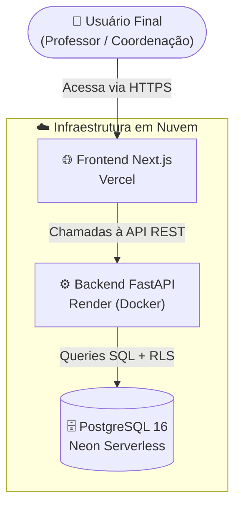
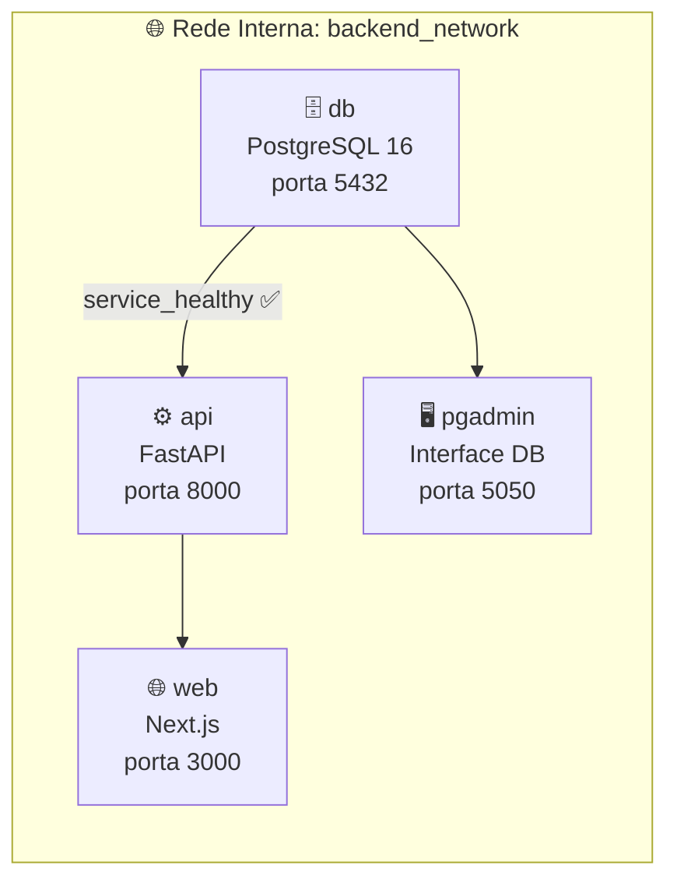
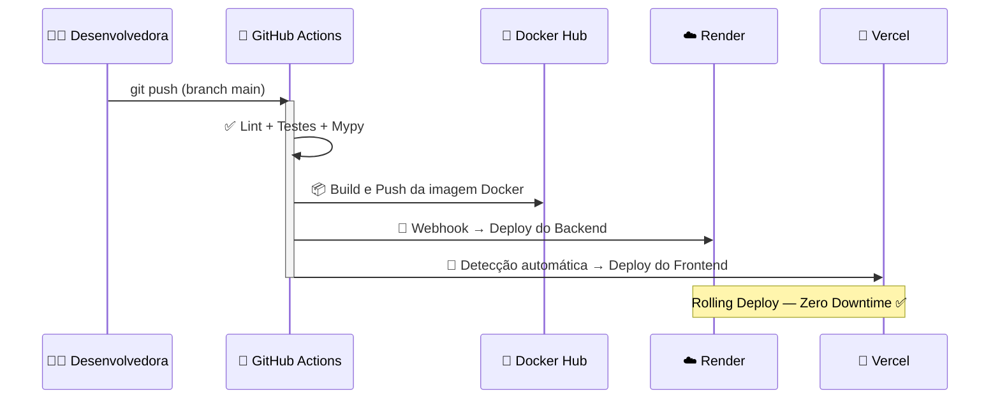

# 🚀 Deploy e Containerização do Sistema AEE

> **Apresentação Técnica — Conferência de Padrão · Parte 4**
> Alinhamento prático com os padrões de Docker e CI/CD

---

## 📋 Agenda

| # | Tópico |
|---|--------|
| 1 | Visão Geral da Arquitetura |
| 2 | Por que Docker? VM vs. Container |
| 3 | Multi-Stage Builds — Imagens Otimizadas |
| 4 | Segurança em Containers |
| 5 | Orquestração Local com Docker Compose |
| 6 | CI/CD com GitHub Actions |
| 7 | Pipeline de Produção do WebAEE |
| 8 | Gerenciamento de Migrações |
| 9 | Resultados Obtidos |

---

## 1️⃣ Visão Geral da Arquitetura

O WebAEE é um sistema multi-camada dividido em **3 microsserviços independentes**, cada um hospedado em plataformas especializadas.



| Camada | Tecnologia | Plataforma |
|--------|-----------|------------|
| 🌐 Frontend | Next.js 15 + TypeScript | **Vercel** |
| ⚙️ Backend | FastAPI + Python 3.12 | **Render** |
| 🗄️ Banco de Dados | PostgreSQL 16 | **Neon** |

---

## 2️⃣ VM vs. Container — Por que Docker?

> **Referência teórica:** *Docker.pdf — Slides 2, 3 e 4*

```
VM Tradicional                    Container Docker
──────────────────────            ──────────────────────
┌──────────────────┐              ┌──────┐ ┌──────┐ ┌──────┐
│    Aplicação A   │              │App A │ │App B │ │App C │
├──────────────────┤              ├──────┴─┴──────┴─┴──────┤
│  Sistema Oper.   │              │    Docker Engine        │
├──────────────────┤              ├─────────────────────────┤
│  Hypervisor      │              │    Sistema Operacional   │
├──────────────────┤              └─────────────────────────┘
│  Hardware        │
└──────────────────┘
⚠️ Pesada: ~GBs          ✅ Leve: ~MBs
⚠️ Boot: ~minutos        ✅ Boot: ~segundos
⚠️ Isolada por SO        ✅ Isolada por processo
```

**No WebAEE:** cada camada roda em seu próprio container isolado, garantindo que o ambiente de *desenvolvimento local* seja **idêntico ao de produção**.

---

## 3️⃣ Multi-Stage Builds — Imagens Otimizadas

> **Referência teórica:** *Docker.pdf — Slide 15 / Deploy.pdf — Slide 20*

A técnica de **múltiplos estágios** usa um container "construtor" pesado e copia apenas o resultado final para uma imagem final enxuta.

### Backend (`backend/Dockerfile`)

```dockerfile
# ── ESTÁGIO 1: Compilação (pesado, descartado após build)
FROM python:3.12-slim AS builder
RUN pip install fastapi sqlmodel alembic asyncpg ...

# ── ESTÁGIO 2: Runtime final (leve, vai para produção)
FROM python:3.12-slim AS runner
COPY --from=builder /opt/venv /opt/venv  # só o virtualenv compilado
COPY --from=builder /app /app            # só o código final
USER appuser                             # ← executa sem root!
```

### Frontend (`frontend/Dockerfile`)

```dockerfile
# Estágio 1: deps    → instala node_modules
# Estágio 2: builder → gera o build Next.js (standalone output)
# Estágio 3: runner  → copia apenas os arquivos mínimos

FROM node:22-alpine AS runner
COPY --from=builder --chown=node:node /app/.next/standalone ./
USER node   # ← executa sem root!
```

**Resultado:** imagens de produção até **70% menores** do que sem multi-stage.

---

## 4️⃣ Segurança em Containers

> **Referência teórica:** *Docker.pdf — Slide 16 / Deploy.pdf — Slide 20*

### 🔒 Usuário não-root

Containers rodando como `root` são uma vulnerabilidade grave. Se o container for comprometido, o atacante obtém controle total do servidor.

| Serviço | Usuário em Produção |
|---------|-------------------|
| Backend (FastAPI) | `appuser` (criado explicitamente) |
| Frontend (Next.js) | `node` (nativo da imagem) |

### ⚡ Limitação de Recursos

No [`docker-compose.yml`](../../docker-compose.yml), cada serviço possui limites estritos para simular o ambiente de produção:

```yaml
deploy:
  resources:
    limits:
      cpus: '1.0'    # max 1 núcleo de CPU
      memory: 512M   # max 512 MB de RAM
```

**Benefício:** evita que um vazamento de memória derrube todo o servidor hospedeiro.

---

## 5️⃣ Orquestração Local com Docker Compose

> **Referência teórica:** *Docker.pdf — Slides 6, 9 e 11*

O arquivo [`docker-compose.yml`](../../docker-compose.yml) orquestra **4 serviços** integrados:



### Recursos de Infraestrutura

| Recurso | Implementação |
|---------|--------------|
| 🔗 Rede Isolada | `driver: bridge` — os serviços comunicam internamente pelo nome |
| 💾 Volume Persistente | `postgres_data` — dados do banco sobrevivem a reinicializações |
| 🏥 Healthcheck | `pg_isready` — API só sobe após banco estar pronto |
| 🔥 Hot-Reload | Volume bind `./backend:/app` — mudanças refletem sem rebuild |

---

## 6️⃣ CI/CD com GitHub Actions

> **Referência teórica:** *Deploy.pdf — Slides 3, 4, 7, 8 e 21*

### O que é CI/CD?

```
CI (Integração Contínua)          CD (Entrega Contínua)
─────────────────────────         ─────────────────────
git push →                        testes passaram →
  Roda testes                       Build da imagem Docker
  Verifica lint                     Push para Docker Hub
  Checa tipos                       Deploy automático
  Reporta erros                     Sistema atualizado 🚀
```

### Workflow no WebAEE



---

## 7️⃣ Pipeline de Produção do WebAEE

### 📁 Workflows no Repositório

```
.github/
└── workflows/
    ├── backend-ci-cd.yml   ← CI + CD do Backend
    └── frontend-ci.yml     ← CI do Frontend
```

### Backend CI/CD ([`backend-ci-cd.yml`](../../.github/workflows/backend-ci-cd.yml))

```yaml
jobs:
  lint-and-test:        # 1. Garante qualidade do código
    - ruff check .      #    Linting
    - mypy .            #    Checagem de tipos
    - pytest --cov=app  #    Testes com cobertura mínima 80%

  build-and-deploy:     # 2. Publica o sistema (só na main)
    needs: lint-and-test
    - docker build      #    Compila imagem multi-stage
    - docker push       #    Envia ao Docker Hub
    - curl (webhook)    #    Aciona deploy na Render
```

### Frontend CI ([`frontend-ci.yml`](../../.github/workflows/frontend-ci.yml))

```yaml
jobs:
  lint-and-test:
    - npm run lint      # ESLint
    - tsc --noEmit      # TypeScript
    - vitest --run      # Testes unitários
# Deploy gerenciado automaticamente pela integração Vercel ↔ GitHub
```

### 🔐 Segredos (Secrets) — Nunca no código!

| Secret | Uso |
|--------|-----|
| `DOCKER_USERNAME` | Login no Docker Hub |
| `DOCKER_PASSWORD` | Senha do Docker Hub |
| `RENDER_DEPLOY_HOOK` | URL de deploy do backend |

---

## 8️⃣ Gerenciamento de Migrações de Banco

> **Referência teórica:** *Deploy.pdf — Slide 9*

### O Desafio

Cada nova funcionalidade pode exigir alterações nas **tabelas do banco de dados**. Como fazer isso sem travar o sistema em produção?

### Solução com Alembic no WebAEE

```python
# app/main.py — FastAPI Lifespan (ciclo de vida da aplicação)

@asynccontextmanager
async def lifespan(app: FastAPI):
    await init_db()   # ← Atualiza tabelas com segurança no startup
    yield
```

```
Fluxo de atualização seguro no Render:
─────────────────────────────────────
1. GitHub Actions gera nova imagem Docker  
2. Render recebe o webhook de deploy       
3. Render inicia novo container            
4. FastAPI executa `init_db()` no startup  
   (cria/atualiza tabelas sem duplicar)    
5. Servidor pronto — tráfego redirecionado 
   (Rolling Deploy / Zero Downtime) ✅    
```

---

## 9️⃣ Resultados Obtidos

### ✅ O que foi entregue?

| Critério | Implementação |
|----------|--------------|
| 🔒 Segurança | Containers sem root, secrets via variáveis de ambiente, CORS restrito por regex |
| ⚡ Performance | Imagens slim + multi-stage, Hot-reload em dev, standalone output no Next.js |
| 🤖 Automação | 100% do deploy automático via GitHub Actions + Webhooks |
| 📊 Qualidade | Lint + Type Check + Testes (80% cobertura) bloqueiam código ruim |
| 🌐 Disponibilidade | Zero downtime com Rolling Deploy na Render |
| 💸 Custo | Infraestrutura 100% gratuita (Render Free + Vercel Free + Neon Free) |

### 🚀 Da alteração ao ar em menos de 3 minutos

```
[00:00] git push
[00:05] GitHub Actions inicia
[01:30] Testes aprovados ✅
[02:00] Docker image publicada 🐳
[02:10] Render inicia Rolling Deploy ☁️
[02:50] Sistema atualizado em produção 🎉
```

---

## 🔗 Links do Projeto em Produção

| Recurso | URL |
|---------|-----|
| 🌐 Sistema (Frontend) | https://aeesistema.vercel.app |
| ⚙️ API (Swagger) | https://webaee-backend-latest.onrender.com/docs |
| 📦 Repositório | [github.com/sthefanybueno/WebAEE](https://github.com/sthefanybueno/WebAEE) |

---

> *Projeto desenvolvido para o Sistema de Atendimento Educacional Especializado (AEE)*
> *Arquitetura alinhada com as melhores práticas de Docker e CI/CD — Parte 4*
